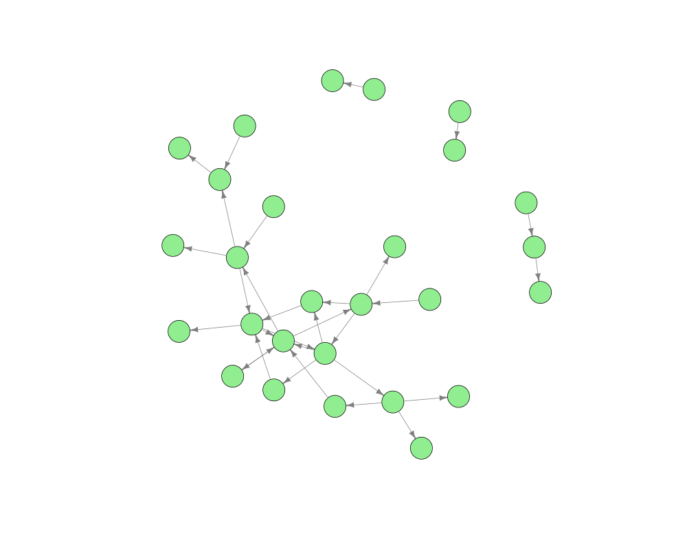
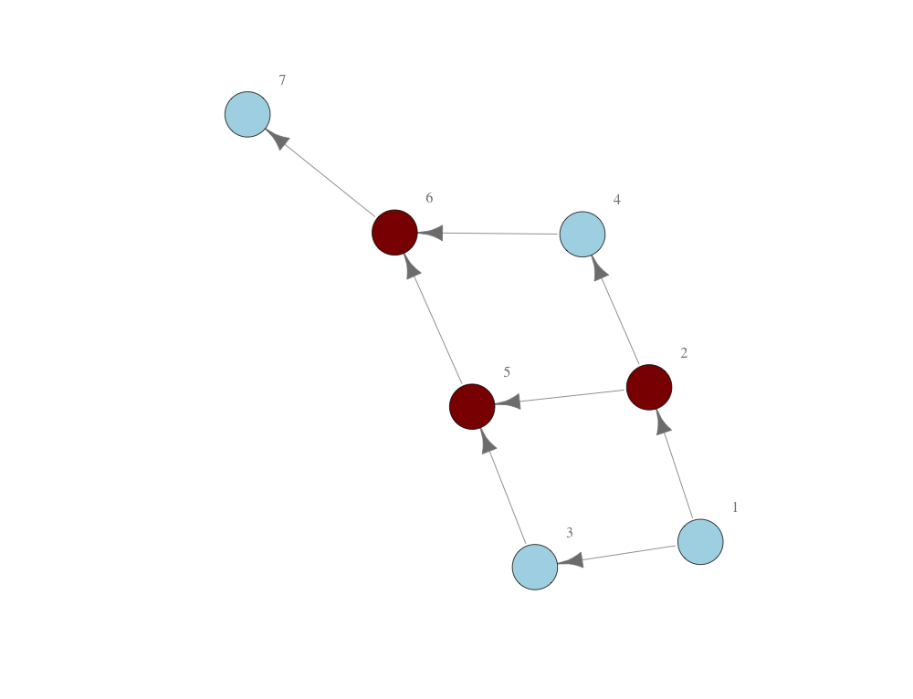
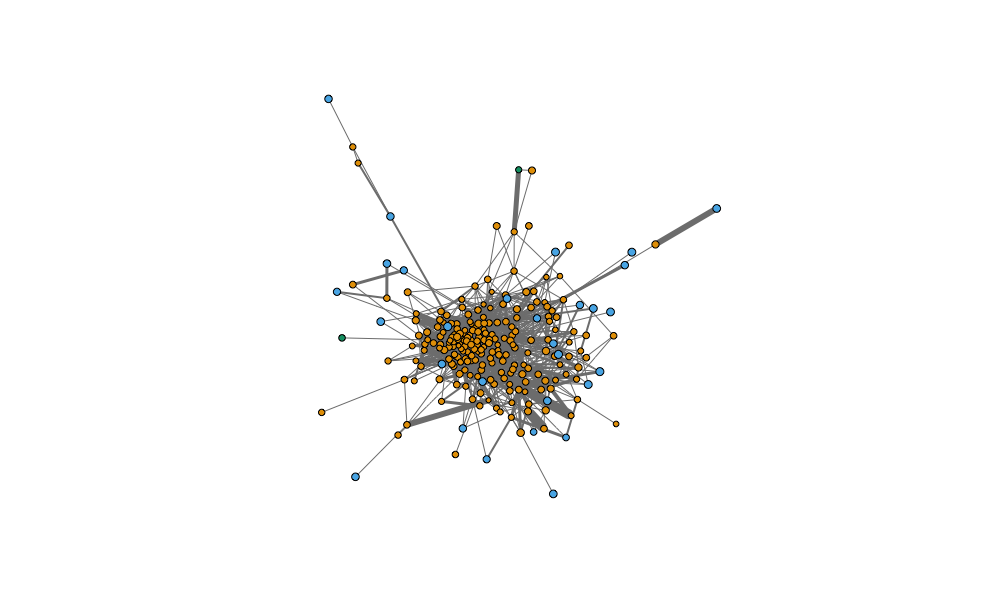
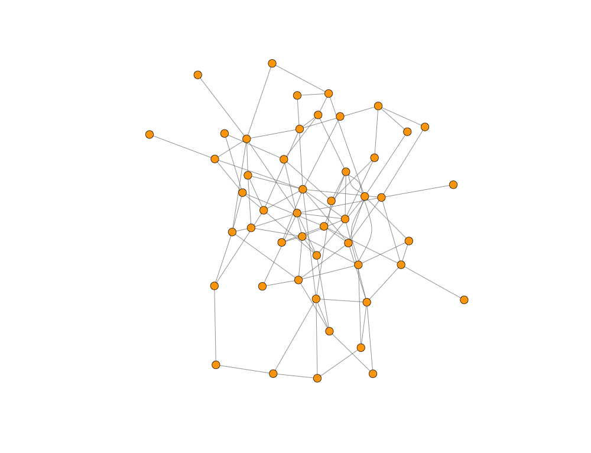
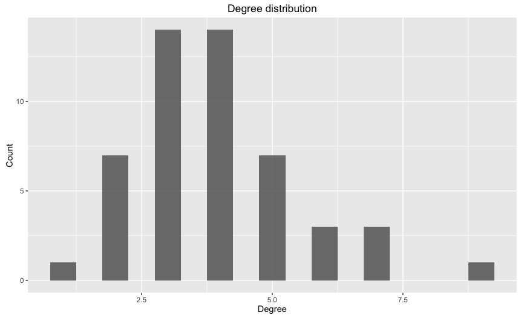

# Network and Hypergraph analytics

## 1 About

This directory provides algorithms that correspond to centrality measures discussed in Chapters 5, 6 and 7 of the monograph. In particular, these measures calculate the middleman position, the brokerage, the coverage and criticality of individual and sets of nodes. These measurements are based on game theoretic concepts--such as Strong Nash Equilibrium--which are also contained in the functions. The algorithms are written, and therefore executable, in the `R` statistical programming language and follow the mathematics within the monograph.

These directories also contain empirical and synthetic data; some of which is also used within the monograph. This is supplied to allow for testing the centrality measures. 

## 2 Networks

### 2.1 Real-world data

Within this repository we are happy to publicly provide four empirical network datasets used within the monograph. The first network dataset is the elite marriage network of Renaissance Florence, which has been used in various representations in a number of network-oriented academic articles. The data was originally sourced from Padgett and Ansell (1994). The static network consists of 32 families and 31 arcs, meaning that a number of families are singletons. Arguably these nodes could be disregarded from the analysis.

The second network dataset is the manager advice network gathered by David Krackhardt (1987). This directed network contains 21 managers from 4 different levels of management and also contains 129 arcs between the managers.

The third dataset refers to four different networks that show the evolution of the interactions between terrorists that coordinated and instigated the 9/11 terrorists attacks. These networks span from December 1999 to August 2001, just before the attack. The size of the network increases over time from 27 terrorists in December 1999 to 32 terrorists in August 2001. The network also becomes more concentrated over time. These networks have been constructed from a number of different sources within academic literature, government reports and journalist articles.

The final dataset refers to a hypergraph representing the directorate of New York City in 1902. We provide a bipartite network of all railways, insurance, and financial institutions as well as their directors. The purpose of this data is to illustrate the control of directors and firms in New York during this time. This network contains over 250 unique firms and 3000 unique directors. There are 4299 links; each link indicates membership of a director to a firm. Since the number of links is greater than the number of unique directors it is certain that overlapping directorate exists. This network has been constructed from historical New York Times articles and the Directory of Directors of New York City. Other sources are used to acquire data on the valuation of each of the firms.

### 2.2 Synthetic data

Consider the directed network in `networkData1.R`. Load the data into your workspace environment by sourcing the relevant file: `source("~/path/to/networkData1.R")`.

The network contains 7 nodes--one of which is a source and another is a sink--and 8 arcs that can be interpreted as the flow of information, money, or economic goods: node 1 is connected to node 7 through the intermediation of other nodes in the network. The network of relationships is plotted in the Figure below.

#### 2.2.1 Middlemen and middleman power

It is pretty obvious from reviewing this network that nodes 2, 5, and 6 are all middlemen. Furthermore, it is noticeable that node 6 would still remain a middleman regardless of whether the network were transformed into its undirected state. We get the following values when running the `middlemanPowerDetail()` function.

	> middlemanPowerDetail(network, N)
	number name power normPower        		type
		 1    1     0       0.0    Non-middleman
		 2    2     1       0.1   Weak middleman
		 3    3     0       0.0    Non-middleman
		 4    4     0       0.0    Non-middleman
		 5    5     2       0.2   Weak middleman
		 6    6     5       0.5 Strong middleman
		 7    7     0       0.0    Non-middleman

As hypothesised we find that nodes 2 and 5 are both weak middlemen and node 6 is a strong middleman. To add to this we also find : (a) the number of relationships brokered by all middleman, and (b) the normalised middleman power for each node. We can represent middlemen visually with the following R commands:

	> colourMiddlemen <- middlemanPowerDetail(network, N)
	> colourMiddlemen$colour <- ifelse(colourMiddlemen$power > 0, "darkred", "lightblue")
	> isTrue <- isUndirected(network, N) == FALSE
	> plot(graph_from_data_frame(network, 
								 directed = isTrue), 
		   vertex.color = middle$colour, 
		   vertex.label.dist = 3, 
		   vertex.size = 20, 
		   edge.color = "gray50")

In this case, the network is plotted such that middlemen are coloured in red and non-middlemen are coloured in blue. This is seen in the Figure below.

#### 2.2.2 Coverage, blocks and set middleman power

We can analyse sets of nodes from the functions developed in `networkFunctions.R`. Again, these functions align with the measures developed in the monograph; of particular interest is Chapter 6. An overview of the coverage of each node set in the network can be found with the `coverage()` function. Specifically, the coverage of the 7 node network is given by:

	> coverage(network, N)
			 set setSize  successors predecessors noSucc noPred coverage
	1:         1       1 2,3,4,5,6,7            0      6      0        0
	2:         2       1     4,5,6,7            1      4      1        4
	3:         3       1       5,6,7            1      3      1        3
	4:         4       1         6,7          1,2      2      2        4
	5:         5       1         6,7        1,2,3      2      3        6
	---                                                                  
	115: 2,3,4,5,7     5           6          1,6      1      2        1
	116: 2,3,4,6,7     5           5          1,5      1      2        1
	117: 2,3,5,6,7     5           4          1,4      1      2        1
	118: 2,4,5,6,7     5                      1,3      0      2        0
	119: 3,4,5,6,7     5                      1,2      0      2        0

The brokerage, or middleman power, of each node set can be derived in much the same way. By executing the `blockPower()` function we arrive at the following output:

	> blockPower(network, N)
			 set setSize  successors predecessors noSucc noPred power
	1:         1       1 2,3,4,5,6,7            0      6      0     0
	2:         2       1     4,5,6,7            1      4      1     1
	3:         3       1       5,6,7            1      3      1     0
	4:         4       1         6,7          1,2      2      2     0
	5:         5       1         6,7        1,2,3      2      3     2
	---                                                               
	115: 2,3,4,5,7     5           6          1,6      1      2     1
	116: 2,3,4,6,7     5           5          1,5      1      2     1
	117: 2,3,5,6,7     5           4          1,4      1      2     1
	118: 2,4,5,6,7     5                      1,3      0      2     0
	119: 3,4,5,6,7     5                      1,2      0      2     0

We can see that a positive coverage does not translate to a positive middleman power. More specifically, the middleman power of a node set is defined on the critical sets of the network. All critical sets are provided with the function `criticalSets()`. The output for the 7 node network is as below:

	> criticalSets(network, N)
			 set setSize successors predecessors noSucc noPred power powerCapita
	1:         2       1    4,5,6,7            1      4      1     1       1.000
	2:         5       1        6,7        1,2,3      2      3     2       2.000
	3:         6       1          7    1,2,3,4,5      1      5     5       5.000
	4:       1,5       2  2,3,4,6,7          2,3      5      2     2       1.000
	5:       1,6       2  2,3,4,5,7      2,3,4,5      5      4     4       2.000
	---
	62: 1,3,4,5,7      5        2,6          2,6      2      2     1       0.200
	63: 2,3,4,5,6      5          7            1      1      1     1       0.200
	64: 2,3,4,5,7      5          6          1,6      1      2     1       0.200
	65: 2,3,4,6,7      5          5          1,5      1      2     1       0.200
	66: 2,3,5,6,7      5          4          1,4      1      2     1       0.200

This function also provides the middleman power per capita, used in Chapter 6 of the monograph.

#### 2.2.3 Criticality

A further measure developed within the monograph is that of criticality. The criticality of individual or sets of nodes is a measure of their assumed brokerage after they have been allowed the ability to form coalitions and actively broker relations. It is therefore a measure based on the resulting stable sets. Within the monograph we use the notion of Strong Nash Equilibrium to determine the stability of a coalition within a network. Each network also has some cost of formation; this cost function can also be determined within the model itself.

For example, when considering the network of 7 nodes when there exists no costs in forming blocks we can determine the Strong Nash Equilibrium as follows:

	> blockSNE(network, N)
	   set setSize successors predecessors noSucc noPred power powerCapita
	1:   6       1          7    1,2,3,4,5      1      5     5           5
	2: 4,5       2        6,7        1,2,3      2      3     6           3
	3: 2,3       2    4,5,6,7            1      4      1     4           2

Specifically, node 6 remains as a middleman and two blocks are formed: one containing nodes 4 and 5, and another containing nodes 2 and 3. All other nodes do not form a block and therefore earn a payoff of zero. If, however, there is some substantial cost of forming a block, then the Strong Nash equilibrium degenerates to the point where no blocks are formed and middlemen are the only nodes that earn a positive payoff. By setting `c = 2` we get the following Strong Nash equilibrium:

	> blockSNE(network, N, c = 2)
	   set setSize successors predecessors noSucc noPred power powerCapita
	1:   6       1          7    1,2,3,4,5      1      5     5           5
	2:   5       1        6,7        1,2,3      2      3     2           2
	3:   2       1    4,5,6,7            1      4      1     1           1

The criticality of individual nodes can be calculated from all potential Strong Nash equilibrium blocks that are known the emerge. Simply, the criticality of all nodes in the network is calculated as:

	> nodeNormCriticality(network, N)
	[1] 0.0 0.2 0.2 0.3 0.3 0.5 0.0

## 3 Hypergraphs

A set of functions for analysing hypergraphs is also provided. These functions revolve around the projection of hypergraphs into different network structures and the measurement of a nodes' or an affiiations' "control" within the hypergraph. This notion of control as a centrality measure is represented by the sigma score and beta measures within hypergraphs. These are discussed in Chapter 7 of the monograph. Using the NYC Director data (`NYCDirectors.R`) we can illustrate an example of an affiliation projection of the directorate hypergraph. Consider the following code.

    > source("~/path/to/NYCDirectors.R")
    > projection <- filterNetwork(affiliationProjection(hypergraph))
    > plot(graph_from_data_frame(projection,
                           directed = FALSE),
           vertex.color = types,
           vertex.label = NA,
           vertex.label.dist = 3,
           vertex.label.color = "black",
           vertex.size = log(valuations)/5,
           edge.width = projection$weight,
           edge.color = "grey50",
           edge.arrow.size = 0)

It is important to understand the structure of the hypergraph data that needs to be passed to the functions. Following example `hypergraphData1.R` should help with this. Data is structured such that a bipartite network is expressed: `nodes` are connected to `affiliations` by an edge, however a set of nodes nor a set of affiliations are connected to each other directly.

### 3.1 Aspectual hypergraphs

Affiliations within a hypergraph can be associated within an "aspect". As such, an affiliation can be associated with one and only one affiliation. We consider these cases and discuss the analysis and formation of elite networks in aspectual hypergraphs.

## 4 Other functions

A number of other functions are defined in `networkFunctions.R`. For example, the `randomGraph()` function provides an Erdos-Renyi graph where the probability of an arc or link existing between any two nodes is explicitly defined within the argument `0 < p < 1`.

	> erdosRenyi <- randomGraph(n = 50, 
								p = 0.05)
	> plot(graph_from_data_frame(erdosRenyi,
		                         directed = FALSE),
		   vertex.color = "orange",
		   vertex.label = NA,
		   vertex.label.dist = 3,
		   vertex.size = 5,
		   edge.color = "gray50",
		   edge.arrow.size = 0)

This provides the following graph

The random nature of its formation is seen in the normally distributed degree distribution. We can form a plot of the degree distribution with the following function `degreeDistribution()`.

